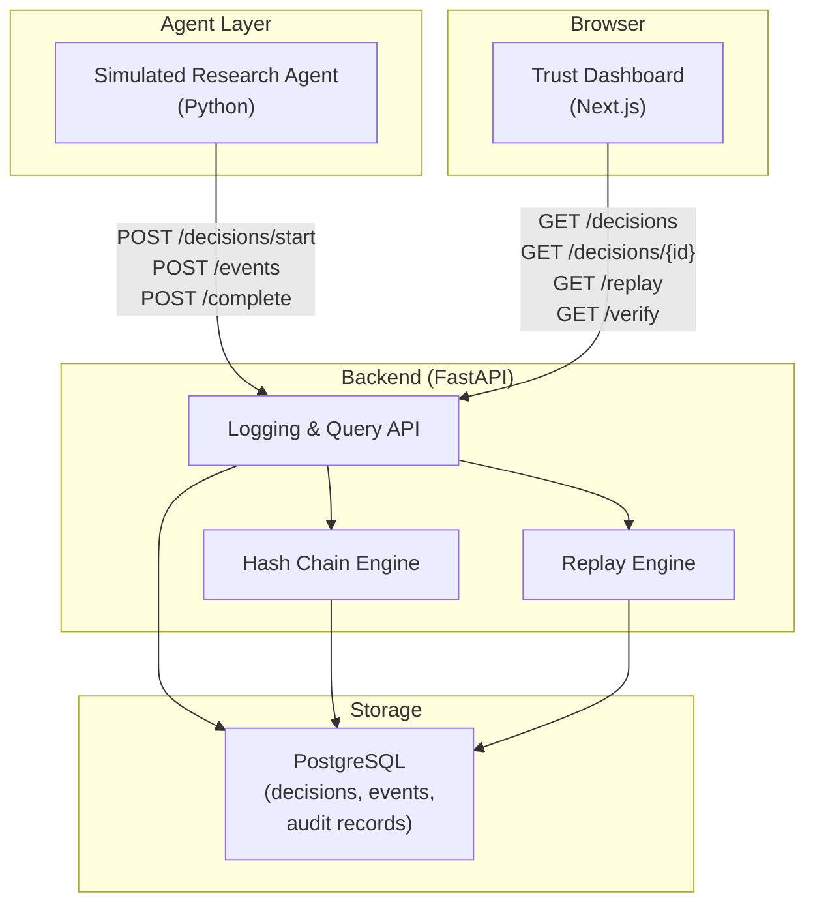

# TrustLedger — Tech Stack & Architecture

> **Goal:** Minimal, open-source stack that a student team can prototype locally in ~4 weeks and demo convincingly.

---

## Technology Choices

### Frontend — Next.js + React + TypeScript

| Factor | Decision |
|--------|----------|
| Why Next.js | File-based routing, fast dev server, easy deployment (Vercel), SSR optional |
| Why React | Team familiarity, large ecosystem, component-based matches dashboard design |
| Why TypeScript | Type safety for API contracts and decision record schema |
| Alternatives considered | Plain React + Vite (simpler but less structure), Vue (less common in capstone teams) |

**Prototype Design Decision:** Next.js App Router with client components for dashboard interactivity. No SSR needed for demo — client-side fetch is sufficient.

**UI library:** Tailwind CSS + shadcn/ui components — fast, professional, accessible defaults.

---

### Backend — FastAPI (Python)

| Factor | Decision |
|--------|----------|
| Why FastAPI | Auto-generated OpenAPI docs, async support, Pydantic validation, Python ecosystem for agent |
| Why Python | Same language as simulated agent; team AI/ML members likely know Python |
| Alternatives considered | Express/Node (EOI mentions it; split language from agent), Django (heavier than needed) |

FastAPI serves:
- Logging API (`/decisions/*`)
- Dashboard data API (`/decisions`, `/decisions/{id}`)
- Replay and verification endpoints
- OpenAPI spec at `/docs` (useful for demo and integration story)

---

### Database — PostgreSQL

| Factor | Decision |
|--------|----------|
| Why PostgreSQL | EOI specifies it; JSONB for flexible decision records; reliable, free, well-documented |
| JSONB usage | Store inputs, structured_rationale, record_snapshot, event details |
| Alternatives considered | SQLite (simpler but weaker JSONB), MongoDB (schema flexibility but less familiar) |

**Prototype Design Decision:** Single PostgreSQL instance. No read replicas, no connection pooling beyond defaults.

---

### Search — PostgreSQL Only (No OpenSearch)

| Factor | Decision |
|--------|----------|
| EOI mentions | OpenSearch/Elasticsearch |
| Prototype decision | **Deferred** — PostgreSQL `ILIKE` + indexed columns sufficient for ~20 demo records |
| When to add | Production or if demo dataset exceeds ~1000 records |

---

### AI Agent — Simulated Python Agent

| Factor | Decision |
|--------|----------|
| Primary | Scripted Python agent (`agents/research_agent.py`) calling TrustLedger API |
| Optional | LLM API (OpenAI/Anthropic) for rationale generation — pay-per-use, EOI's one licensed component |
| Why scripted first | Demo reliability — no API rate limits, no latency surprises during presentation |

---

### Integrity — SHA-256 Hash Chaining

| Factor | Decision |
|--------|----------|
| Algorithm | SHA-256 (Python `hashlib`) |
| Storage | `audit_records` table in PostgreSQL |
| Chain scope | Global chain across all sealed records |
| EOI alignment | "Tamper-evidence demoed via hash-chaining on a standard DB" |

**Not using:** Blockchain, HSM, WORM storage — production considerations only.

---

### Deployment — Local + Optional Cloud

| Environment | Setup |
|-------------|-------|
| **Development** | Docker Compose: PostgreSQL + FastAPI + Next.js dev server |
| **Demo** | Same laptop, localhost URLs |
| **Optional cloud** | Railway / Render / Vercel for remote demo access |

**Not using:** Kubernetes, Kafka, microservices, CI/CD pipelines (beyond basic GitHub Actions if time permits).

---

## Architecture Diagram



---

## Data Flow

### Write Path (Agent → Record)

```
1. Agent calls POST /decisions/start
   → Task row created in PostgreSQL
   → case_received event inserted

2. Agent calls POST /decisions/{id}/events (multiple)
   → DecisionEvent rows appended (sequence auto-increment)
   → Evidence/policy extracted to JSONB

3. Agent calls POST /decisions/{id}/complete
   → Decision row created
   → Full snapshot assembled
   → HashEngine computes SHA-256 hash, links to chain
   → AuditRecord row inserted
   → record_sealed event appended
   → Task status updated
```

### Read Path (Dashboard → User)

```
1. Dashboard calls GET /decisions?status=...
   → Returns task summaries for Kanban columns

2. User clicks task → GET /decisions/{id}
   → Returns full record (task + events + evidence + policies + decision + audit)

3. User opens Replay tab → GET /decisions/{id}/replay
   → ReplayEngine assembles ordered steps from stored events

4. User opens Integrity tab → GET /decisions/{id}/verify
   → HashEngine recomputes hash, compares to stored, checks chain link
```

---

## Project Structure (Planned)

```
TrustLedger/
├── docs/                          # This documentation
├── backend/
│   ├── app/
│   │   ├── main.py                # FastAPI app entry
│   │   ├── models/                # SQLAlchemy models
│   │   ├── schemas/               # Pydantic request/response schemas
│   │   ├── routes/
│   │   │   ├── decisions.py       # Decision CRUD + events
│   │   │   ├── audit.py           # Verification endpoints
│   │   │   └── agents.py          # Agent registration
│   │   ├── services/
│   │   │   ├── hash_chain.py      # SHA-256 chain logic
│   │   │   ├── replay.py          # Replay assembly
│   │   │   └── sealer.py          # Record sealing
│   │   └── db.py                  # Database connection
│   ├── agents/
│   │   └── research_agent.py        # Simulated agent
│   ├── seed/
│   │   └── demo_data.json         # Pre-built decision records
│   ├── tests/
│   ├── requirements.txt
│   └── Dockerfile
├── frontend/
│   ├── src/
│   │   ├── app/
│   │   │   ├── page.tsx           # Kanban dashboard
│   │   │   └── decisions/[id]/
│   │   │       └── page.tsx       # Decision detail (tabs)
│   │   ├── components/
│   │   │   ├── KanbanBoard.tsx
│   │   │   ├── TaskCard.tsx
│   │   │   ├── DecisionTimeline.tsx
│   │   │   ├── ReplayViewer.tsx
│   │   │   └── IntegrityPanel.tsx
│   │   └── lib/
│   │       └── api.ts             # API client
│   ├── package.json
│   └── Dockerfile
├── docker-compose.yml
└── README.md
```

---

## API Documentation

FastAPI auto-generates OpenAPI spec at `http://localhost:8000/docs` — useful for:
- Demo: show evaluators the API-first design
- Development: test endpoints without frontend
- Integration story: "Any agent can integrate via these 5 endpoints"

---

## Environment Variables

```env
# Backend
DATABASE_URL=postgresql://<user>:<password>@localhost:5432/trustledger  # set via .env, never committed
API_HOST=0.0.0.0
API_PORT=8000

# Frontend
NEXT_PUBLIC_API_URL=http://localhost:8000/api/v1

# Optional: LLM agent
OPENAI_API_KEY=sk-...   # only if using LLM-powered agent
```

---

## Local Development Setup (Planned)

```bash
# 1. Start database
docker compose up postgres -d

# 2. Start backend
cd backend
pip install -r requirements.txt
uvicorn app.main:app --reload --port 8000

# 3. Seed demo data
python -m seed.load_demo_data

# 4. Start frontend
cd frontend
npm install
npm run dev

# 5. (Optional) Run simulated agent
cd backend
python -m agents.research_agent
```

---

## Testing Strategy (Prototype)

| Layer | Approach |
|-------|----------|
| Hash chain | Unit tests — append, verify, tamper detection |
| API | Integration tests — start → events → complete → get → verify |
| Replay | Unit test — correct step ordering and content |
| Frontend | Manual testing for demo; no automated E2E in 4-week scope |

---

## Security (Prototype vs. Production)

| Concern | Prototype | Production (future) |
|---------|-----------|-------------------|
| Authentication | None | API keys + OAuth |
| Authorization | None | RBAC (analyst/partner sees engagements they own) |
| Encryption at rest | PostgreSQL default | AES-256 + KMS |
| Encryption in transit | HTTP localhost | TLS everywhere |
| PII | Synthetic data only | Redaction pipeline |
| Audit log immutability | Application-enforced | WORM storage + DB triggers |

---

## Why Not X?

| Technology | Why excluded from prototype |
|-----------|---------------------------|
| Kubernetes | Over-engineering for local demo |
| Kafka / RabbitMQ | No async event streaming needed |
| Redis | No caching needed at demo scale |
| OpenSearch | PostgreSQL sufficient for ~20 records |
| Microservices | Monolith (FastAPI) is simpler and faster |
| GraphQL | REST is simpler for 5-endpoint API |
| Blockchain | Hash chain on PostgreSQL demonstrates concept |
| WebSockets | Dashboard polls every 30s; no real-time requirement |
