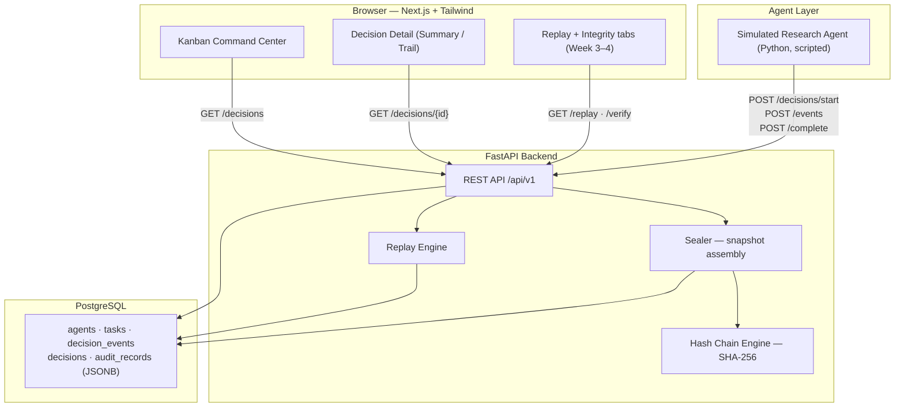

# TrustLedger — High-Level Design (HLD)

> **Audience:** Mentors, reviewers, evaluators
> **Status:** Implemented (Phase 1 complete — see `10_Current_Status.md`)
> **Design sources:** `02_Data_Driven_Design.md`, `03_Agent_Based_Design.md`, `05_Tech_Stack_and_Architecture.md`

---

## 1. What TrustLedger Is (Simple Text)

TrustLedger is a **trust layer that wraps around AI agents**. It never makes business decisions itself. When an AI research agent makes a high-stakes recommendation (e.g., whether a client should enter a market or acquire a target), TrustLedger:

1. **Records** every step the agent takes — as it happens
2. **Structures** the record in plain business language (evidence, methodology clauses, rationale)
3. **Seals** the record with a cryptographic hash chain (tamper-evident)
4. **Shows** everything on a dashboard a QRM/partner can use
5. **Replays** the decision later, step by step, from stored data only

**One line:** The agent decides. TrustLedger records and verifies.

---

## 2. System Context Diagram

```
                        ┌────────────────────┐
   Client research engagement ─► │   Simulated AI     │
   (synthetic data)             │   Research Agent   │
                        └─────────┬──────────┘
                                  │ calls API at each step
                                  ▼
┌──────────────┐        ┌────────────────────┐        ┌──────────────┐
│  Compliance  │◄──────►│     TrustLedger    │◄──────►│  PostgreSQL  │
│  Officer     │  view  │  FastAPI Backend   │ store  │ JSONB records│
│ (browser)    │        │  logging · replay  │        │ + hash chain │
└──────────────┘        │  verify            │        └──────────────┘
                        └────────────────────┘
```

- **Agent → Backend:** writes only (start, events, complete)
- **Browser → Backend:** reads only (list, detail, replay, verify)
- **Backend → DB:** all persistence, JSONB documents + hash chain table

---

## 3. Component Architecture (Mermaid)



---

## 4. The Decision Lifecycle (Core Flow)

```
1. POST /decisions/start
      → Task created (status: running) + "case_received" event

2. POST /decisions/{id}/events        (repeated, append-only)
      → data_retrieved, policy_retrieved, clause_identified,
        evidence_evaluated ... each gets an auto sequence number

3. POST /decisions/{id}/complete
      → decision_generated + record_sealed events appended
      → Decision row created (outcome + structured rationale)
      → Full snapshot assembled → SHA-256 hash → chained to previous record
      → Task status: completed OR review_required

4. READ PATH (any time later)
      → GET /decisions/{id}          full record
      → GET /decisions/{id}/replay   ordered step-by-step reconstruction
      → GET /decisions/{id}/verify   tamper check (recompute + compare)
      → GET /decisions/chain/verify  walk the entire chain
```

**Rule:** events are append-only. After sealing, no more writes to that task. Replay uses stored data only — the agent is never re-executed.

---

## 5. Data Model (High Level)

```
Agent ──< Task ──< DecisionEvent (append-only, unique sequence per task)
                    ├── Evidence      (embedded in event details)
                    ├── PolicyRef     (embedded in event details)
                    └── Decision (1:1, on complete)
                          └── AuditRecord (1:1, sealed snapshot + hash)
```

| Table | Purpose | Key fields |
|-------|---------|-----------|
| `agents` | Which AI system decided | name, version, domain |
| `tasks` | One Kanban card / case | case_id, status, risk_level, inputs (JSONB) |
| `decision_events` | Chronological audit steps | sequence, event_type, summary, details (JSONB) |
| `decisions` | Final outcome | outcome, structured_rationale (JSONB) |
| `audit_records` | Sealed, tamper-evident snapshot | record_hash, previous_hash, record_snapshot (JSONB), chain_sequence |

JSONB columns use PostgreSQL `JSONB` (indexable/queryable); SQLite generic JSON is used only for tests.

---

## 6. Integrity Design (Hash Chain)

```
Record 0:  hash_0 = SHA-256( canonical_json(snapshot_0) + "GENESIS" )
Record 1:  hash_1 = SHA-256( canonical_json(snapshot_1) + hash_0 )
Record 2:  hash_2 = SHA-256( canonical_json(snapshot_2) + hash_1 )
...
```

- **Canonical JSON:** keys sorted, no whitespace, UTF-8 → deterministic hashing
- **Verification:** recompute hash from stored snapshot + previous_hash; compare; walk whole chain to confirm links
- **Tamper test:** editing a sealed snapshot (e.g., changing "partial approval" to "full approval") breaks verification — proven by automated test
- **Scope note (documented limitation):** unkeyed SHA-256 on a standard DB is prototype-grade. A DB writer could rewrite the chain. Production would use HMAC/external signing, WORM storage — explicitly out of scope per `08_Scope_and_Non_Goals.md`

---

## 7. API Surface (Summary)

| Method & Path | Purpose | Called by |
|---|---|---|
| `POST /api/v1/agents` | Register an agent | setup |
| `POST /decisions/start` | Open a decision record | agent |
| `POST /decisions/{id}/events` | Append audit event | agent |
| `POST /decisions/{id}/complete` | Record outcome + seal | agent |
| `GET /decisions` | List/filter for Kanban | dashboard |
| `GET /decisions/{id}` | Full decision record | dashboard |
| `GET /decisions/{id}/replay` | Ordered replay steps | dashboard |
| `GET /decisions/{id}/verify` | Tamper check (single) | dashboard |
| `GET /decisions/chain/verify` | Verify whole chain | dashboard |

Interactive docs auto-generated at `http://localhost:8000/docs` (OpenAPI).

---

## 8. Frontend Design

| Screen | Answers | Status |
|--------|---------|--------|
| Agent Command Center (Kanban, 4 columns) | What is happening? | Built (scaffold) |
| Decision Detail — Summary + Trail | What was decided, and why? | Built (scaffold) |
| Decision Replay tab | Can we reconstruct it? | Week 3 |
| Integrity tab | Was it tampered with? | Week 4 |

Stack: Next.js (App Router) + TypeScript + Tailwind CSS (shadcn/ui components added at Week 3 kickoff). Polls the API every 30s — no WebSockets needed at demo scale.

---

## 9. Technology Choices (and Why)

| Layer | Choice | Why |
|-------|--------|-----|
| Backend | FastAPI (Python) | Auto OpenAPI docs, Pydantic validation, same language as agent |
| Database | PostgreSQL + JSONB | Flexible decision documents + queryable structure |
| Integrity | SHA-256 chain | Tamper evidence without blockchain complexity |
| Frontend | Next.js + Tailwind | Fast iteration, professional compliance-tool look |
| Agent | Scripted Python | Demo reliability — no API rate limits or latency surprises |
| Runtime | Docker Compose | One command to run the whole stack locally |

---

## 10. Design Principles

1. **TrustLedger observes; it does not decide** — the agent keeps its logic untouched
2. **Business-readable over technical** — no chain-of-thought, no raw prompts, no ML jargon in the UI
3. **Append-only + sealed** — records are never edited, corrections would be new events
4. **Demo-first scope** — every feature must serve the 3–5 minute evaluator demo
5. **Boring infrastructure** — monolith, one DB, no Kafka/K8s; complexity only where it proves the thesis (the hash chain)
